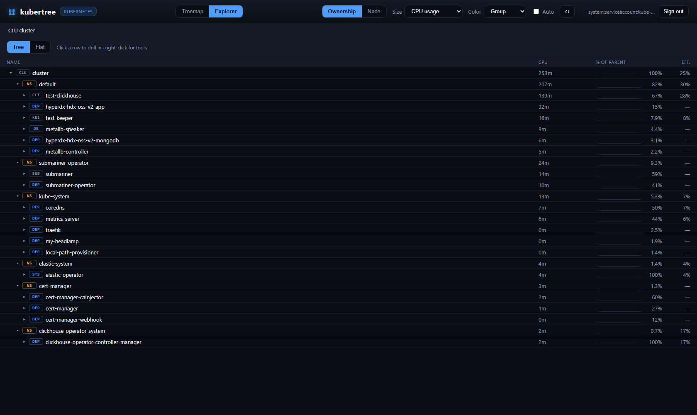

<p align="center">
  
</p>

A WizTree-style resource treemap for **Kubernetes** and **OpenShift**. Connect a
cluster and see every workload as a zoomable treemap grouped by its ownerReference
chain (namespace → Deployment/DeploymentConfig/StatefulSet/CRD → pod → container),
sized by live usage or requested resources and colored by efficiency to expose
over-provisioning — plus a WizTree-style **Explorer** tab and functional tools
(logs, exec, scale, restart, cordon/drain, cascade delete) gated by *your* permissions.


The **Explorer** tab is a filesystem-style drilldown of the same data — a Tree view
(expand/collapse, % of parent, efficiency) and a Flat view (every container by full
path, sorted by size):



## Why
- **Instant.** Reads the live metrics API — no 25-minute ETL like cost tools.
- **Right-sizing, not billing.** Color cells by usage/request to find waste.
- **Owner-aware.** Generic ownerReference climb groups a whole operator-managed
  cluster (e.g. a `CassandraDatacenter`) under one node.
- **Acts as you.** Every call uses *your* identity; the cluster's own RBAC decides
  what you can see and do, and the UI hides actions you aren't allowed.
- **Portable.** Runs on vanilla Kubernetes and OpenShift; metrics optional.

## Tools
Select a cell (or right-click anywhere, in either tab) for kind-aware tools. Each is
shown only if your token is allowed to perform it (checked via SelfSubjectAccessReview):

| Resource | Tools |
|---|---|
| Pod / Container | **Logs** (tail + follow), **Exec** (in-browser shell), View YAML, Events, Delete |
| Deployment / DeploymentConfig | **Scale**, **Restart**, **Rollout undo**, View YAML, Events, Delete |
| StatefulSet / DaemonSet / ReplicaSet | Scale / Restart (where applicable), View YAML, Events, Delete |
| Node | **Cordon / Uncordon**, **Drain**, View YAML, Events |
| Namespace | View YAML, Events, Delete (cascade) |

Deletes use foreground propagation, so deleting an owner removes everything it owns.

## Authentication — how login works
kubertree never runs as a shared admin ServiceAccount. It acts as the calling user
and lets the cluster's RBAC be the guardrail.

| Where it runs | How users authenticate | Setup |
|---|---|---|
| **Local** (`python -m kubertree`) | Your `~/.kube/config` identity is used directly — no login screen. | none |
| **Vanilla Kubernetes** (in-cluster) | Paste a bearer token once; kept in an httpOnly session cookie. | front with TLS |
| **OpenShift** (in-cluster) | SSO via the `oauth-proxy` sidecar (reuses the console login). | `oauthProxy.enabled=true` |

In-cluster, kubertree **never** falls back to its own ServiceAccount — an
unauthenticated request is rejected, so the app pod holds no standing cluster powers
(on OpenShift the SA gets only `system:auth-delegator` so the proxy can verify tokens).

Get a token for the paste flow with `kubectl create token <serviceaccount>` or your
own `oc whoami -t`.

## Run locally
```bash
pip install -e .
python -m kubertree    # http://127.0.0.1:8000 — uses ~/.kube/config as you
```
If the metrics API is not installed, kubertree falls back to request-based sizing
and shows a banner.

### Configuration (env vars)
| Variable | Default | Purpose |
|---|---|---|
| `KUBERTREE_HOST` | `127.0.0.1` | Bind address (`0.0.0.0` in the image) |
| `KUBERTREE_PORT` | `8000` | Bind port |
| `KUBECONFIG` | `~/.kube/config` | Kubeconfig path for local runs |

## Container
All-in-one image (backend serves the static UI). OpenShift-safe: runs as an arbitrary
non-root UID in group 0. Published to **Docker Hub**.
```bash
docker build -t docker.io/poortuna/kubertree:0.2.0 .
docker run -p 8000:8000 -v ~/.kube/config:/app/.kube/config:ro \
  -e KUBERTREE_HOST=0.0.0.0 -e KUBECONFIG=/app/.kube/config \
  docker.io/poortuna/kubertree:0.2.0
docker push docker.io/poortuna/kubertree:0.2.0     # private Docker Hub
```

## Deploy with Helm
Private image → create a pull secret first:
```bash
kubectl create secret docker-registry regcred -n kubertree --create-namespace \
  --docker-server=https://index.docker.io/v1/ \
  --docker-username=poortuna --docker-password=$DOCKERHUB_TOKEN
```

### OpenShift (SSO)
```bash
helm install kubertree ./helm/kubertree -n kubertree --create-namespace \
  --set image.tag=0.2.0 --set imagePullSecrets[0].name=regcred \
  --set oauthProxy.enabled=true --set route.enabled=true
```
The sidecar terminates TLS with an OpenShift service-serving cert and forwards each
user's token; the Route is set to reencrypt automatically.

### Vanilla Kubernetes (token-paste login)
```bash
helm install kubertree ./helm/kubertree -n kubertree --create-namespace \
  --set image.tag=0.2.0 --set imagePullSecrets[0].name=regcred \
  --set ingress.enabled=true --set ingress.host=kubertree.example.com
```
Terminate TLS at the ingress — the session cookie carries a bearer token. See
[docs/HELM.md](docs/HELM.md) for all values.

## RBAC
By design kubertree needs **no** ClusterRole of its own: actions run as the user, so
their existing roles apply. On OpenShift the only binding created is to the built-in
`system:auth-delegator` (for the proxy's TokenReview/SubjectAccessReview). A user who
can only read their namespace sees only their namespace; a cluster-admin sees the
whole cluster.

## Architecture
The backend is a `kubertree/` package split into `auth`, `k8s`, `tools`, and `api`;
the frontend is vanilla ES modules under `kubertree/static`. See
[docs/ARCHITECTURE.md](docs/ARCHITECTURE.md) for the module map and request flow.

## Tests
```bash
pip install -e ".[dev]"
pytest tests/unit
```

## Limits
- Live snapshot, not historical (no Prometheus backend yet).
- metrics-server lag of ~15–60s after a pod starts.
- Rollout undo is best-effort (re-applies the previous ReplicaSet's pod template).
