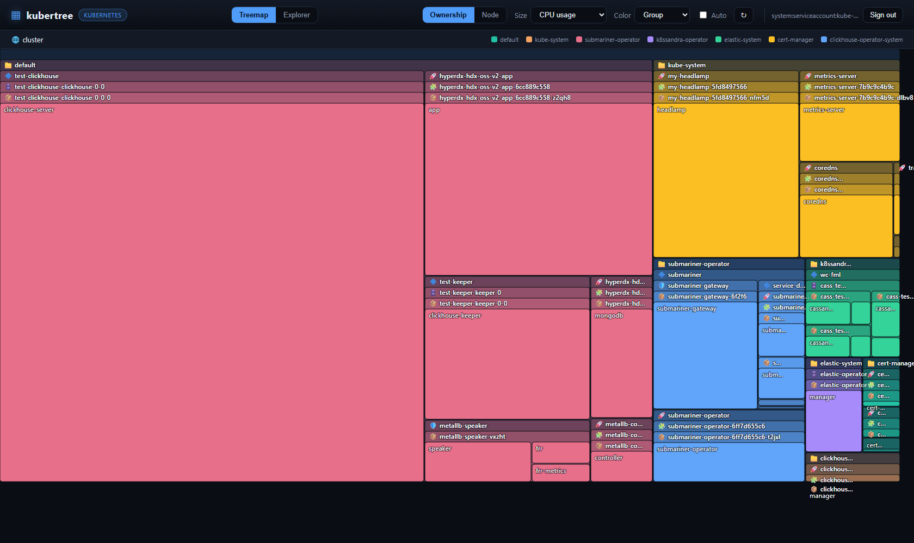

# kubertree

A WizTree-style resource treemap for **Kubernetes** and **OpenShift**. Connect a
cluster, see every workload as a zoomable treemap grouped by its ownerReference
chain (namespace → Deployment/DeploymentConfig/StatefulSet/CRD → pod → container),
sized by live usage or requested resources, colored by efficiency to expose
over-provisioning. Select any owner to **cascade-delete** it and everything it owns.



## Why
- **Instant.** Reads the live metrics API — no 25-minute ETL like cost tools.
- **Right-sizing, not billing.** Color cells by usage/request to find waste.
- **Owner-aware.** Generic ownerReference climb groups a whole operator-managed
  cluster (e.g. a `CassandraDatacenter`) under one node.
- **Portable.** Runs on vanilla Kubernetes and OpenShift; metrics optional.

## Run locally
```bash
pip install -r requirements.txt
python app.py          # http://127.0.0.1:8000 — uses ~/.kube/config
```
If the metrics API is not installed, kubertree falls back to request-based sizing
and shows a banner.

## Container
All-in-one image (backend serves the static UI). The image is OpenShift-safe: it
runs as an arbitrary non-root UID in group 0.
```bash
docker build -t ghcr.io/poortuna/kubertree:0.1.0 .
docker run -p 8000:8000 -v ~/.kube/config:/app/.kube/config:ro \
  -e KUBECONFIG=/app/.kube/config ghcr.io/poortuna/kubertree:0.1.0
docker push ghcr.io/poortuna/kubertree:0.1.0     # private GHCR
```

## Deploy with Helm
Private image → create a pull secret first:
```bash
kubectl create secret docker-registry regcred -n kubertree --create-namespace \
  --docker-server=ghcr.io --docker-username=poortuna --docker-password=$GHCR_PAT
```

### Kubernetes
```bash
helm install kubertree ./chart -n kubertree \
  --set image.repository=ghcr.io/poortuna/kubertree --set image.tag=0.1.0 \
  --set imagePullSecrets[0].name=regcred \
  --set ingress.enabled=true --set ingress.host=kubertree.example.com
```

### OpenShift
```bash
helm install kubertree ./chart -n kubertree \
  --set image.repository=ghcr.io/poortuna/kubertree --set image.tag=0.1.0 \
  --set imagePullSecrets[0].name=regcred \
  --set route.enabled=true
```

## RBAC
The chart binds a ClusterRole with cluster-wide **read** (build the tree) and
**delete** (cascade delete from the UI). This is broad by design — kubertree is a
cluster admin/optimization tool. To supply your own (e.g. read-only) role, set
`rbac.create=false` and bind the ServiceAccount yourself.

## Architecture
| Concern | Module |
|---|---|
| Cluster config (in-cluster + kubeconfig) | `_k8s_client.py` |
| Platform & metrics detection | `_platform.py` |
| Usage from metrics API + quantity parsing | `_metrics.py` |
| Pod listing + generic owner climb | `_inventory.py` |
| Hierarchy assembly | `_tree.py` |
| Cascade delete | `_resources.py` |
| HTTP API + static serving | `app.py` |
| D3 treemap UI | `static/` |

## Tests
```bash
pip install pytest
pytest
```

## Limits
- Live snapshot, not historical (no Prometheus backend yet).
- metrics-server lag of ~15–60s after a pod starts.
